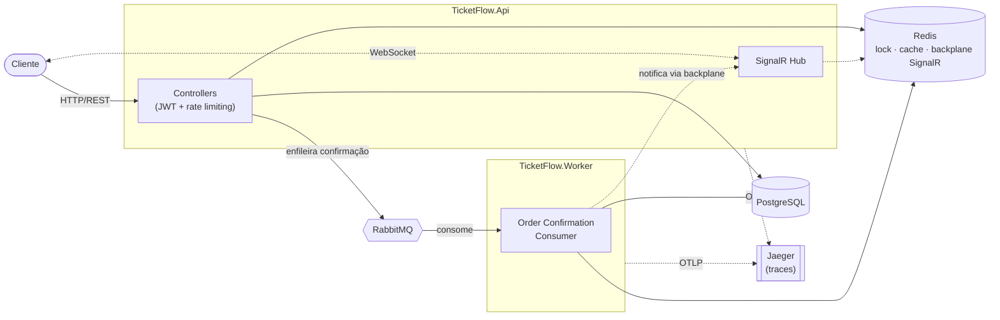

# TicketFlow API

Backend de portfólio simulando uma plataforma de venda de ingressos de alto
fluxo — o foco é resolver, de verdade, o problema de concorrência de
"milhares de pessoas tentando comprar o mesmo assento ao mesmo tempo", com
Clean Architecture, PostgreSQL/EF Core, Redis (lock distribuído, cache e
backplane do SignalR), RabbitMQ (confirmação assíncrona via worker),
SignalR (mapa de assentos e confirmação de pedido em tempo real), rate
limiting nos endpoints mais sensíveis a abuso, e observabilidade completa
(métricas Prometheus + tracing distribuído com OpenTelemetry, conectando
API e worker num único trace).

O raciocínio por trás de cada decisão está documentado em
[`docs/DECISOES-DE-ARQUITETURA.md`](docs/DECISOES-DE-ARQUITETURA.md) — vale
a leitura antes de mexer no código. As 9 fases do roadmap original estão
todas implementadas e testadas de ponta a ponta.

## Arquitetura



O trace de uma compra atravessa as duas caixas: `reserve` acontece
inteiramente na API (protegido por lock distribuído no Redis);
`confirm` só enfileira e retorna — quem confirma de verdade é o worker,
que também é quem notifica o comprador via SignalR (através do mesmo
Redis, sem nenhuma conexão WebSocket própria).

## Rodando localmente

Pré-requisitos: .NET 8 SDK, Docker Desktop.

### Tudo em containers (mais simples)

```bash
docker compose up -d --build
```

Sobe Postgres, Redis, RabbitMQ, Jaeger, a API e o worker — tudo junto,
numa rede Docker isolada. A API fica em `http://localhost:5299`.

### API/worker locais, infra em container (melhor pra desenvolver)

```bash
docker compose up -d postgres redis rabbitmq jaeger
dotnet run --project src/TicketFlow.Api
```

Em outro terminal:

```bash
dotnet run --project src/TicketFlow.Worker
```

Iterar em código é mais rápido assim (sem rebuild de imagem a cada
mudança). A API aplica as migrations do EF Core automaticamente em
ambiente de desenvolvimento.

### Endpoints úteis

- Documentação interativa (Scalar): `/scalar/v1`
- Painel do RabbitMQ: `http://localhost:15672` (`guest`/`guest`)
- Hub do SignalR: `/hubs/ticketflow` (token JWT via query string
  `?access_token=...`, já que o handshake do WebSocket não permite header
  customizado)
- Traces: `http://localhost:16686` (UI do Jaeger) — faça uma reserva e
  confirme o pedido pra ver um trace só atravessando a API e o worker
- Métricas de negócio em formato Prometheus: `/metrics` na API e
  `http://localhost:9464/metrics` no worker

Limites de requisição: 100 req/min por IP (global), 5 req/min por IP em
`/api/auth/register` e `/api/auth/login`, e 5 reservas por 10s por usuário
em `/api/orders/reserve` (token bucket). Estourar o limite retorna `429`
com header `Retry-After`.

## Testes

```bash
dotnet test
```

`TicketFlow.Domain.Tests` são testes unitários puros (sem dependências).
`TicketFlow.IntegrationTests` sobe a API real contra Postgres/Redis/RabbitMQ
**reais** via [Testcontainers](https://testcontainers.com/) — containers
Docker descartáveis, criados e destruídos automaticamente a cada execução —
e prova a concorrência de verdade: disparar várias reservas simultâneas
para o mesmo assento e confirmar que só uma vence. Precisa do Docker
rodando, mas **não** precisa do `docker compose up` manual — os containers
de teste são isolados dos containers de desenvolvimento.

## Estrutura

```
src/
  TicketFlow.Domain          — entidades e regras de negócio, zero dependências externas
  TicketFlow.Application     — casos de uso, interfaces, DTOs, validação
  TicketFlow.Infrastructure  — EF Core, Redis, RabbitMQ, SignalR Hub, OpenTelemetry, JWT, hashing de senha
  TicketFlow.Api             — controllers, autenticação, composição
  TicketFlow.Worker          — consome a fila de confirmação de pedidos
tests/
  TicketFlow.Domain.Tests       — testes xUnit das regras de domínio
  TicketFlow.IntegrationTests   — testes de concorrência de ponta a ponta (Testcontainers)
docs/
  DECISOES-DE-ARQUITETURA.md — o porquê de cada decisão, fase a fase
```

## Roadmap (concluído)

| Fase | O quê |
|---|---|
| 0-1 | Clean Architecture, domínio rico, JWT, FluentValidation, Scalar |
| 2 | PostgreSQL + EF Core |
| 3 | Redis — lock distribuído + cache |
| 4 | RabbitMQ + worker — confirmação assíncrona |
| 5 | SignalR — tempo real (backplane no Redis) |
| 6 | Rate limiting |
| 7 | Testes de integração de ponta a ponta (Testcontainers) |
| 8 | Observabilidade — métricas + tracing distribuído (OpenTelemetry) |
| 9 | Empacotamento final — Docker Compose completo, este README |
